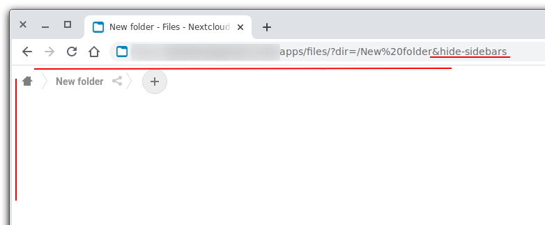

# Hide sidebars

Hide left sidebar and top header bar for use in iframe for example or some other scenarios.

## Usage 
Add `hide-sidebars` after `?` as query parameter to nextcloud url or with `dir` parameter after `&`.

Examples:
```
http://nextcloud.example.com/index.php/apps/files/?hide-sidebars
http://nextcloud.example.com/index.php/apps/files/?dir=/New%20folder&hide-sidebars
```

## Screenshot

